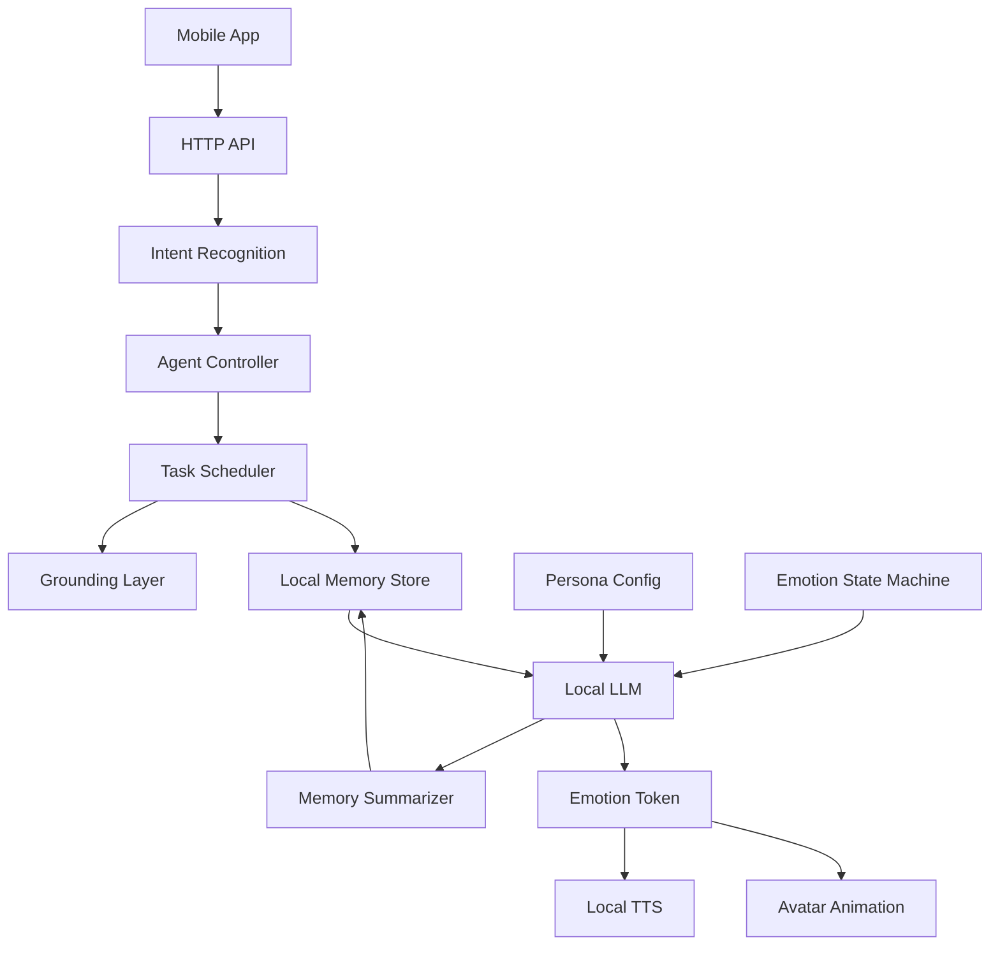

# Digital Loved One Architecture

This backend is organized around a device-first persona runtime. The current
implementation uses JSON persistence by default so development stays simple,
while the persistence boundary is ready for an ObjectBox-backed local memory
store.

## Layer Mapping



## Current Package Roles

- `cmd/server`: HTTP shell for upload, chat, and health checks.
- `ingestion`: parses raw data and writes excerpts/topics into memory.
- `memory`: local memory boundary. `GraphStore` is the default JSON store.
- `grounding`: validates whether the retrieved memory is sufficient before
  inference.
- `conflict`: detects factual and belief conflicts between excerpts.
- `persona`: chat engine that will become the Agent controller.
- `inference`: voice gateway placeholder for STT, LLM, and TTS.

## ObjectBox Plan

Use `memory.Store` everywhere outside persistence code. This keeps ingestion,
grounding, persona, and server code independent from the storage engine.

Default development mode:

```bash
STORE_ENGINE=json STORE_PATH=./data go run ./cmd/server
```

ObjectBox mode after generated bindings and native ObjectBox runtime are added:

```bash
STORE_ENGINE=objectbox STORE_PATH=./objectbox-data go run -tags objectbox ./cmd/server
```

The tagged files `memory/objectbox_entities.go`, `memory/objectbox_store.go`,
and `memory/factory_objectbox.go` are the integration point for generated
ObjectBox boxes and queries.

## Next Runtime Pieces

- Add an embedding model behind a `memory.VectorIndex` interface.
- Store excerpt embeddings in ObjectBox once vector search is enabled for the
  target mobile runtime.
- Move response generation from `cmd/server` into `persona.Engine`.
- Add `State` and `EmotionToken` types so text, TTS, and avatar output share
  the same emotional intent.
